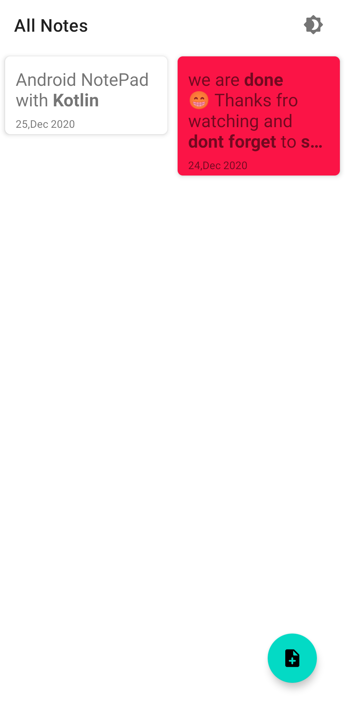
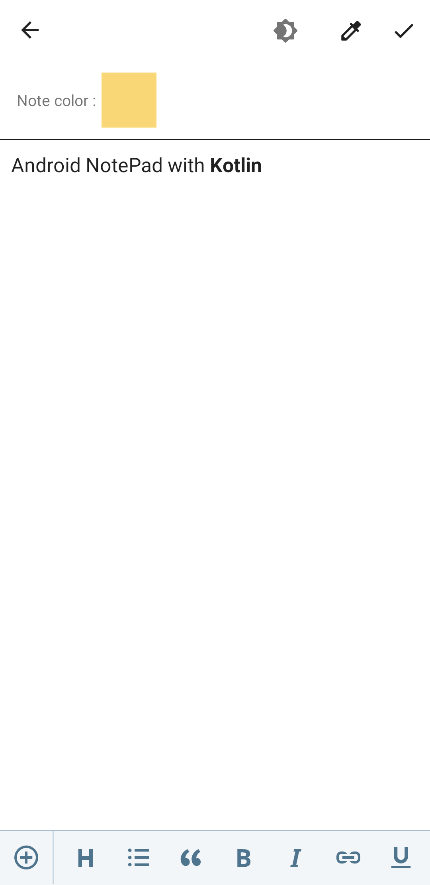
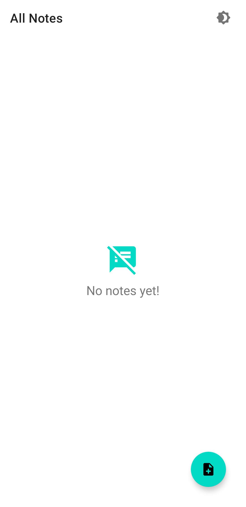
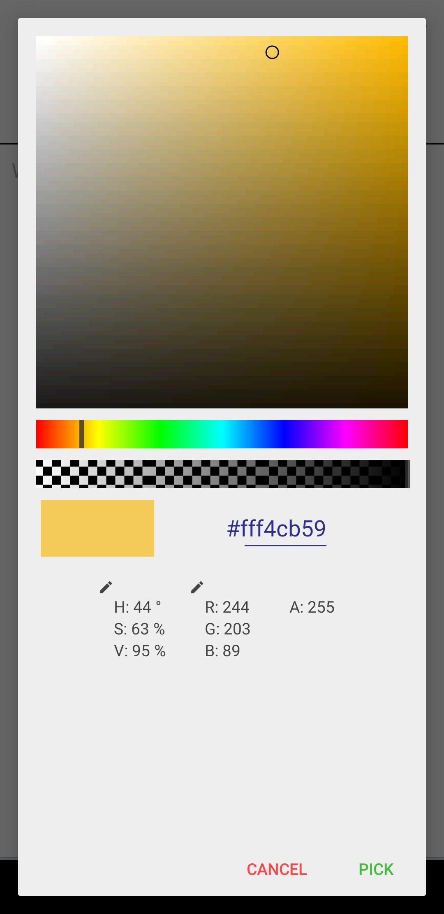
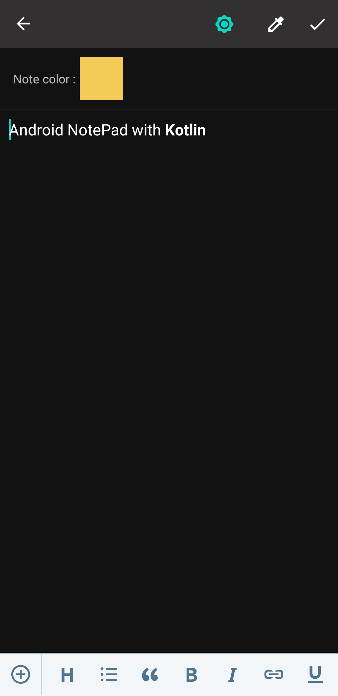
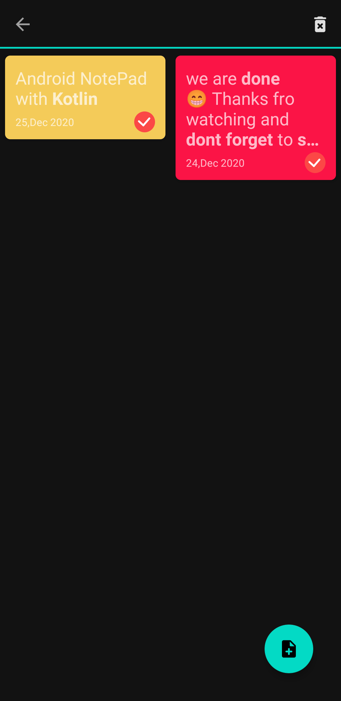
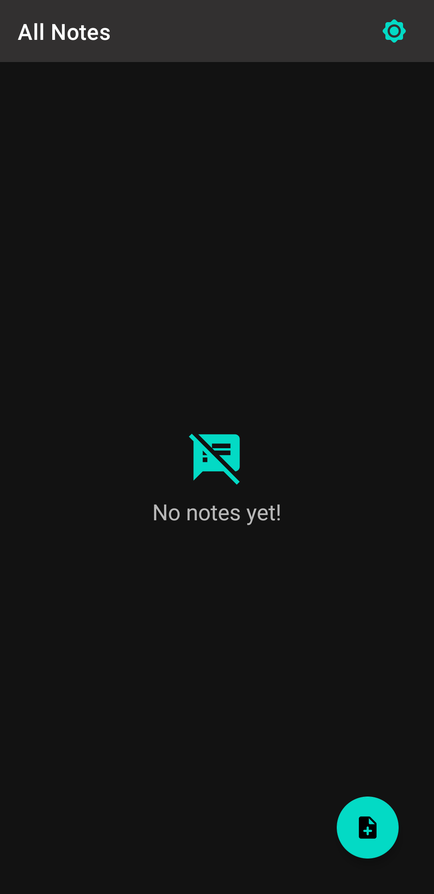
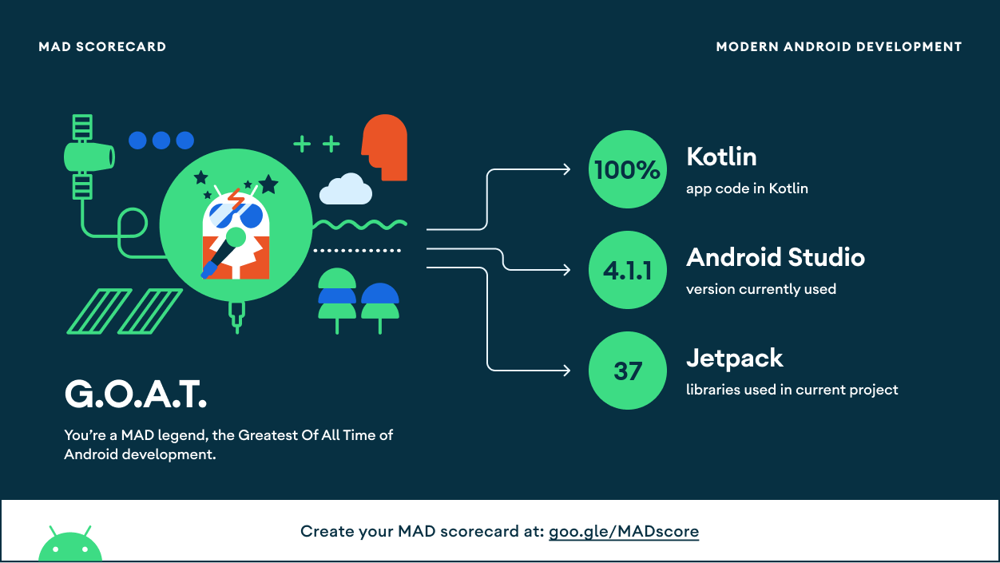

SampleMVVMNotePad
=================

  

A sample Android NotePad Build with Kotlin

## Features
  - MVVM design pattern architecture
  - Navigation component ( Single Activity with Fragments)
  - Dependency Injection with Hilt Library
  - Database With Room 

## ScreenShots

  
  
  
  

 

  
  
  

 

## MAD Scorecard

  

<a href="https://madscorecard.withgoogle.com/scorecard/share/393509780/"> Check All MAD Score details</a>

## Youtube tutorial videos

- [How to make modern MVVM Android App  in Android Studio 2021  - Part 1](https://youtu.be/AmpqsCA0big)
- [How to make modern MVVM Android App  in Android Studio 2021  - Part 2](https://youtu.be/ReinMO1ZSGo)
- [How to make modern MVVM Android App  in Android Studio 2021  - Part 3](https://youtu.be/acdZp2hPw8k)
- [How to make modern MVVM Android App  in Android Studio 2021  - Part 4](https://youtu.be/TzmtsF4mb28)

